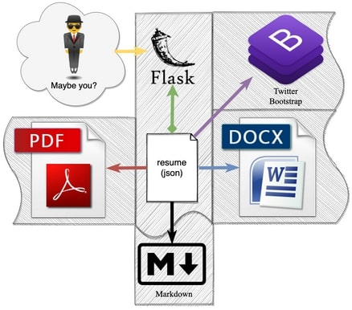
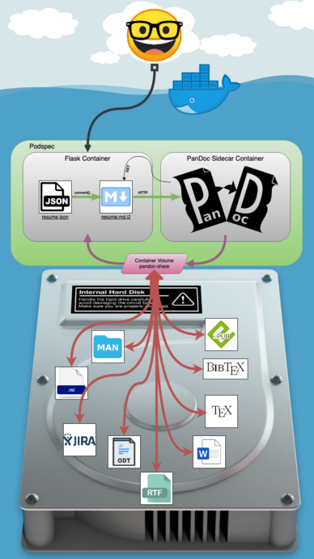

# Resume - Jonathan D Kelley - jon-kelley.com

This Git repository serves two purposes:

* Store my resume in HTML(5) / Bootstrap / Markdown / PDF / DOCX
* Showcase some skill as "Devops Engineer" by building a piece of automated engineering that utilize several languages, containers, and technology stacks together.
  * Docker
  * docker-compose
  * kubernetes (and sidecars)
  * Unit testing integration
  * Makefile (m4 macro language)
  * Docker build/publish scripts
  * Docker volumes
  * Python3
  * Flask
  * BASH
  * Jinja2
  * Pandoc
  * HTML5, Jquery, CSS, and Bootstrap
  * Software integration
  * Great docs

# Table of Contents

   * [Resume - Jonathan D Kelley - jon-kelley.com](#resume---jonathan-d-kelley---jon-kelleycom)
      * [Introduction](#introduction)
         * [The showcase](#the-showcase)
         * [My resume](#my-resume)
         * [Why?](#why)
         * [Architecture Overview](#architecture-overview)
         * [K8s Architecture Overview](#k8s-architecture-overview)
      * [Quick Start Guide](#quick-start-guide)
         * [Unit Tests](#unit-tests)
         * [Run from docker-compose](#run-from-docker-compose)
         * [Kubernetes install](#kubernetes-install)
            * [Install Pod, PVC and Service](#install-pod-pvc-and-service)
         * [Running in minikube](#running-in-minikube)
            * [Install Pod](#install-pod)
            * [Expose Service](#expose-service)
         * [Local install](#local-install)
      * [Build and Publish using the Makefile](#build-and-publish-using-the-makefile)
      * [Contributers](#contributers)
      * [Inspiration](#inspiration)


## Introduction

### The showcase

This repository is a showcase around docker, kubernetes, python, flask, markdown, json, REST and sidecars to make a very simple app serve my resume. From `Makefile` to production you'll see how I've deployed my website, and the Flask app I wrote lives in the center of all of this. My flask app even permits [being updated](https://jon-kelley.com/resume/update) from the `resume.json` in this repository after it's been built to make dynamic updates post-deployment easier.

### My resume

See this code live on my website [Jon-Kelley.com](https://jon-kelley.com) 100% powered by Kubernetes!

### Why

Having a resume for years in Markdown as data format and converting to PDF/DOCX etc using Pandoc grew tiring over the years. Portability and maintainability was always a concern.

Now I'm storing all my experience in a JSON file and just letting code handle the rest. We can dockerize anything, why not my our resume? Now I update `resume.json` and use the eventual consistency model for my resume.

### Architecture Overview

A simplified component diagram of this architecture is below which should give you a simplified idea of how the codebase works, even if you're not technical.



### K8s Architecture Overview



## Quick Start Guide

### Unit Tests

I've provided behavior-driven tests using pydoc. To invoke tests, you can run

```
pip3 install -r requirements-test.txt

make test
```

### Run from docker-compose

This is how I prefer to develop my Docker projects.

If you have docker-compose installed, you can simply run

```
docker-compose build
docker-compose up
```

or, more simply

```
make run
```

Then open [127.0.0.1:5001](http://127.0.0.1:5001).

### Kubernetes install

#### Create app secret

This secret is used to do dynamic updates to resume.json while the application is running.
```
kubectl create secret generic secret-jonk-resume-app --from-literal=resume-update-secret=changeme
```

#### Install Pod, PVC and Service

```
kubectl apply -f https://raw.githubusercontent.com/jondkelley/python_resume/master/k8s-resources/k8s-baremetal.yaml
```

### Running in minikube

#### Create app secret

This secret is used to do dynamic updates to resume.json while the application is running.
```
kubectl create secret generic secret-jonk-resume-app --from-literal=resume-update-secret=changeme
```

#### Install Pod
```
kubectl apply -f https://raw.githubusercontent.com/jondkelley/python_resume/master/k8s-resources/k8s-minikube.yaml
```

#### Expose Service
```
kubectl expose deployment jonk-resume-app --type=NodePort
minikube service jonk-resume-app --url
```

You'll see output similar to
```
 🏃  Starting tunnel for service jonk-resume-app.
|-----------|-----------------|-------------|------------------------|
| NAMESPACE |      NAME       | TARGET PORT |          URL           |
|-----------|-----------------|-------------|------------------------|
| default   | jonk-resume-app |             | http://127.0.0.1:12345 |
|-----------|-----------------|-------------|------------------------|
```

You can visit http://127.0.0.1:12345 to use the application.

### Local install

Always an option, but the pandoc container won't work with this, so the hard-copy resume links will throw errors.

    git clone https://github.com/jondkelley/python_resume.git
    cd python_resume
    virtualenv venv
    source venv/bin/activate
    python3 setup.py install
    myresume &

Then open [127.0.0.1:5001](http://127.0.0.1:5001).

## Build and Publish using the Makefile

Quickly make and publish artifacts to dockerhub.

```
make build
make push
```

## Contributers

* 2021 Jonathan Kelley

## Inspiration

This Resume was inspired by an interactive dynamic resume created by web designer **[Pascal Van Gemert](http://pascalvangemert.nl/)** ([Github](https://github.com/pascalvgemert/resume)).

I ported his PHP / bootstrap framework over to Python / Flask / Jinja2, with my own inspiration along the way. Then I Dockerized my project and made it work on my bare metal kubernetes cluster using emptyDir volumes and MetalLB for load balancing. Docker-compose is available for local development and running the unit tests.

The container is built using a sidecar running pandoc in a bash loop, and uses the emptyDir volume to make various rendered resume formats (every 10 seconds) available to the Flask webserver.
